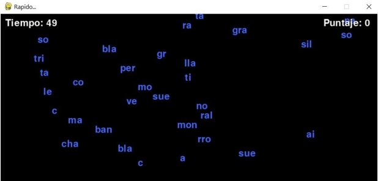
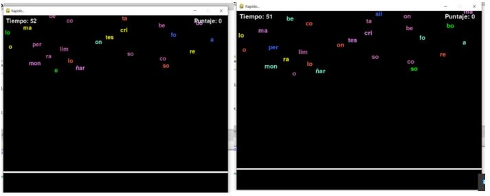

# Introducción a la Programación
## Trabajo práctico - Primer Semestre 2021

Integrantes
Agustina Mendez, 39707636/2014, <agustina.996@hotmail.com> 

Kevin Montenegro, 39707593/2018, <kevinmontenegroac@gmail.com> 

:title-page:
:numbered:
:source-highlighter: coderay
:tabsize: 4

== Introducción

El siguiente trabajo está destinado a poner en práctica los conocimientos sobre el lenguaje Python adquiridos a lo largo de la materia, implementando una serie de funciones que permitirán poner en correcto funcionamiento un juego.  

Para el juego, cada jugador contará con 60 segundos para escribir palabras con las sílabas que van apareciendo en pantalla. Si la palabra es correcta, sumará puntos y desaparecerán las sílabas utilizadas. Las sílabas aparecerán desde el margen superior de la pantalla y si no fueron utilizadas, descenderán hasta el margen inferior y desaparecerán. 

Para este trabajo se nos proporcionó un archivo con el programa principal. Este se encarga de capturar la entrada del teclado, llevar la cuenta de los puntos y del tiempo, así como también de dibujar en la pantalla. El programa toma las sílabas al azar desde el archivo sílabas2silabas.txt y les asigna una posición. Luego, espera que el jugador escriba una palabra y chequea que esta sea correcta (esto se hace verificando que la palabra se construya con sílabas que aparecen en pantalla y que sea una palabra que se encuentra dentro de lemario.txt). Para estas tareas, se hace uso de la biblioteca de código PyGame.  

Para trabajar de manera conjunta sobre el código, usamos, la página de programación online: replit.com, google Drive y encuentros a través de Meet. 

== Funciones a implementar

Función def lectura (archivo, lista) debe leer el archivo y guardarlo en una lista: 

Utilizamos la función readlines para obtener una lista de todas las líneas del archivo de texto. Al hacer la prueba de escritorio, notamos un error, cuando quisimos imprimir la lista con las sílabas del archivo, nos devolvió  “\n” al final de cada cadena de la lista. (Para un archivo de prueba devuelve: lista = ['ads\n', 'af\n', 'ag\n', 'ah\n', 'ahi\n', 'ahin\n', 'ahir\n']). 

Para corregir este problema utilizamos la función def subcadenas (cadena, inicio, fin) que recibe una cadena, dos posiciones y devuelve una nueva cadena entre las posiciones dadas. 

[source, python]
----
def subcadena (cadena, inicio, fin):
  subcad=""
  for letra in range (inicio, fin-1):
    subcad+=cadena[letra]
  return subcad
def lectura (archivo, lista):
  lista1 = archivo.readlines ()
  for linea in lista1:
    cad = subcadena(linea, 0, len(linea))
    if cad!="":
      lista.append(cad)
  archivo.close()
  return (lista)
----
Función def nuevaSilaba (sílabas) recibe la lista de sílabas y devuelve una al azar. 

Primero, intentamos resolver esta definición utilizando el random.randrange que trabaja con números. Cómo queremos trabajar con cadenas, decidimos buscar otra alternativa. Así, fue que encontramos, en internet, la función random.choice que sirve para cadenas, y la utilizamos  para obtener sílabas al azar de una lista. 

[source, python]
----
def nuevaSilaba(silabas):
  silaba = random.choice(silabas)
  return silaba
----

Función def Puntos(candidata) recibe la palabra y devuelve el puntaje correspondiente (vocales: 1 punto; consonantes (menos j,k,q,w,x,y,z): 2 puntos; (j,k,q,w,x,y,z): 5 puntos) 

Iniciamos un contador suma y a través de un ciclo vamos revisando letra por letra de la palabra candidata para asignar el puntaje correspondiente. 

[source, python]
----
def Puntos(candidata):
  suma=0
  for letra in candidata:
    if letra=="a" or letra=="e" or letra=="i" or letra=="o" or letra=="u":
      suma=suma+1
    else:
      if letra=="j" or letra=="k" or letra=="q" or letra=="w" or letra=="x" or letra=="y" or letra=="z":
        suma=suma+5
      else:
        suma=suma+2
  return suma
----

Función def actualizar (silabasEnPantalla, posiciones, listaDeSilabas) que recibe las sílabas que están en pantalla, sus posiciones y la lista de todas las sílabas. Debe eliminar las sílabas y sus posiciones cuando empiezan a escaparse de la pantalla, también debe ir actualizando las posiciones de las sílabas para que vayan descendiendo y agregando nuevas posiciones, siempre con el cuidado que no se superpongan, ni se escapen de la pantalla. 

Utilizamos la función random para obtener sílabas al azar de listaDeSilabas. Esta sílaba al azar, la agregamos a la lista silabasEnPantalla. También vamos a necesitar asignarle una posición aleatoriamente a esa sílaba (dentro de los rangos de la pantalla). Para el rango de las posiciones, después de varias pruebas, llegamos a que: x se mueve entre 0 y 740 e y se mueve entre -15 y 500. 

Para controlar que las sílabas no se superpongan, usamos dos funciones auxiliares.  La función damePosicion que elige de manera aleatoria las posiciones de las sílabas y verifica con la función posicionValida que no se superpongan. La función posicionValida revisa con un ciclo que:  

* La posición y sea menor a cero. Para que el ciclo no se demore en comparar con todas las posiciones de la lista, le vamos a pedir que -15 ≤ y ≤ 0. De esa manera controlamos desde antes que aparezcan en pantalla que no se superpongan.  
* La posición x, al hacer la diferencia entre las posiciones x que ya están en la lista y esta nueva x, debería darnos una distancia de 40 o más para asegurarnos que si las sílabas tienen una longitud muy larga, no se superpongan. 

[source, python]
----
def damePosicion (posiciones):
  posicionX = ramdom.randint(0,741)
  posicion = [posicionX, -15]
  while not posicionValida(posicion, posiciones):
    posicion = [posicionX, -15]
  return posicion
def posicionValida(posicion, posiciones):
  i=0
  while i<len(posiciones):
    if posiciones[i][j] <= 0 and (posiciones[i][j] - posicion[0] < 50 and posiciones[i][j] - posicion[0] > -50):
      return False
    i=i+1
  return true
def actualizar(silabasEnPantalla, posiciones, listaDeSilabas):
  silabasEnPantalla.append(nuevaSilaba(listaDeSilabas))
  posiciones.append(damePosicion(posiciones))
  s=0
  while s<len(silabasEnPanralla):
    if posiciones[s][1]>=500:
      silabasEnPantalla.pop(s)
      posiciones.pop(s)
    else:
      posiciones[s][1]+=10
    s=s+1
----

Funcion def esValida(candidata,silabasEnPantalla,lemario) recibe la palabra que escribe el usuario, la lista de sílabas en pantalla y el lemario. Se debe verificar que la palabra es correcta. 

Para verificar que la palabra es válida, necesitamos revisar que se haya escrito con sílabas que se encuentren en la pantalla. Para esto creamos las funciones def estaEnPantalla (lista,silabasEnPantalla) y aparece (cadena,lista).  

La función aparece (cadena,lista) dice si una cadena está dentro de una lista. Entonces, con la función def estaEnPantalla (lista,silabasEnPantalla),  a partir de una lista creada con la función dameSilabas, se verifica, por medio de la función aparece (cadena,lista),  si las sílabas de la lista están o no en la pantalla. 

Si la función estaEnPantalla devuelve True, vamos a verificar que la palabra candidata se encuentre en el lemario. Para esto volvimos a utilizar la función aparece. 

[source, python]
----
def aparece (cadena,lista):
    for p in range (len(lista)):
        if lista[p]==cadena:
            return True
    return False
def estaEnPantalla (lista,SilabasPantalla):
    for s in lista:
        if aparece(s,SilabasPantalla)==False:
            return False
    return True
def esValida(candidata,silabasEnPantalla, lemario):
    lista=dameSilabas(candidata) #funcion que separa en silabas las palabras
    if estaEnPantalla(lista,silabasEnPantalla)==True and aparece(candidata,lemario)==True:
            return True
    else:
        return False
----

Función def dameSilabas (candidata) recibe la palabra que escribió el usuario y devuelve una lista con sus sílabas. 

Utilizamos la función separador que recibe una palabra y devuelve una cadena con las sílabas de la palabra separadas por un guión. A partir de esta palabra separada en guiones, a través del ciclo for, creamos una lista con las sílabas de la palabra ingresada por el usuario. 

[source, python]
----
def dameSilabas(candidata):
    palabra = separador(candidata) #devuelve una cadena con la palabra separada en silabas
    silabas=[]
    sil=""
    for l in palabra:
        if l!="-":
            sil=sil+l
        else:
            silabas.append(sil)
            sil=""
    silabas.append(sil)
    return silabas
----
Función def quitar (candidata, silabasEnPantalla, posiciones) que recibe la palabra que ingresó el usuario, la lista de sílabasEnPantalla, y sus respectivas posiciones, y debe quitar las sílabas de candidata de la pantalla. 

Utilizamos la función dameSilabas para obtener una lista de sílabas de la cadena escrita por el jugador.  

Después, con un ciclo for, recorrimos las sílabas de candidata y a su vez recorrimos la lista sílabasEnPantalla, con un while,  para eliminar de esta lista, la primera vez que aparecen las sílabas utilizadas en candidata. 

[source. python]
----
def quitar(candidata, silabasEnPantalla, posiciones):
    silabas = dameSilabas(candidata) #separando en silabas (arma una lista)
    for elem in silabas:
        cont=0
        while cont<len(silabasEnPantalla):
            if elem==silabasEnPantalla[cont]:
                silabasEnPantalla.pop(cont)
                posiciones.pop(cont)
                break
            else:
              cont=cont+1
----

== Funciones opcionales
Función def quitarLemario (candidata, lemario) que recibe la palabra que ingresó el usuario y el lemario. Una vez que el jugador ingresó una palabra válida, se elimina de la lista lemario para que no se vuelva a utilizar (no suma puntos si forma con las sílabas en pantalla dos veces “casa” por ejemplo) y así aumentar la dificultad del juego. 

Utilizamos un ciclo que elimina la candidata una vez que localiza en qué posición de la lista lemario se encuentra. 

[source, python]
----
def quitarLemario(candidata, lemario):
    cont=0
    while cont<len (lemario):
        if lemario[cont] == candidata:
            lemario.pop(cont)
            return lemario
        cont=cont+1
----

Función  def cambiarColor () que elige de manera aleatoria colores para darselos a las sílabas que aparecen en pantalla. 

Luego de investigar  las coordenadas de los diferentes colores en Python, armamos una lista con algunos de ellos. 
 
* Amarillo: (255,255,0)
* Azul: (65,105,255)
* Rojo: (255,99,71)
* Verde: (0,255,0)
* Violeta: (238,130,238)
* Rosa: (205,105,180)
* Celeste: (127,255,212) 
 
Elegimos utilizar solo estos ya que al elegirlos de forma aleatoria corremos el riesgo de que salga la coordenada de color negro o similar y no se distingan por el color de fondo. 

[source, python]
----
listaColor = [(255,255,0),(0,255,0),(65,105,255),(255,99,71),(205,105,180),(127,255,212),(238,130,238)]
def cambiarColor():
    color = random.randint (0,len(listaColor)-1)
    return (listaColor[color])
----
En principio, esta función la llamamos en el archivo configuración. Al ejecutar el programa, se elegía de manera aleatoria uno de los colores de la lista y todas las sílabas quedaban del mismo color.  
[source, python]
----
from collections import namedtuple
from funcionesAuxiliares import *

TAMANNO_LETRA = 20
FPS_inicial = 3
TIEMPO_MAX = 61

ANCHO = 800
ALTO = 600

#COLOR_LETRAS = cambiarColor()
COLOR_FONDO = (0,0,0)
COLOR_TEXTO = (250,250,250) #tiempo puntos
COLOR_TIEMPO_FINAL = (200,20,10)
Punto = namedtuple('Punto','x y')
----

Por eso, a esta función la llamamos dentro de la función dibujar, que está dentro del archivo extras, para cambiar los colores de la sílaba.  

Nuestro objetivo con esta función, en un principio era que cada sílaba quedara con un color diferente, pero fijo.  Pero en el resultado final, las sílabas van cambiando constantemente, a medida que caen, de color. A pesar de no haber llegado al objetivo, decidimos implementarlo de esta manera para que sea más llamativo. 

[source, python]
----
def dibujar(screen, candidata, listaNombres, posiciones, puntos, segundos):
    defaultFont= pygame.font.Font( pygame.font.get_default_font(), TAMANNO_LETRA)
    #Linea del piso
    pygame.draw.line(screen, (255,255,255), (0, ALTO-70) , (ANCHO, ALTO-70), 5)
    ren1 = defaultFont.render(candidata, 1, COLOR_TEXTO)
    ren2 = defaultFont.render("Puntaje: " + str(puntos), 1, COLOR_TEXTO)
    if(segundos<15):
        ren3 = defaultFont.render("Tiempo: " + str(int(segundos)), 1, COLOR_TIEMPO_FINAL)
    else:
        ren3 = defaultFont.render("Tiempo: " + str(int(segundos)), 1, COLOR_TEXTO)
    for i in range(len(listaNombres)):
        screen.blit(defaultFont.render(listaNombres[i], 1, cambiarColor()), posiciones[i])
    screen.blit(ren1, (190, 570))
    screen.blit(ren2, (680, 10))
    screen.blit(ren3, (10, 10))
----

